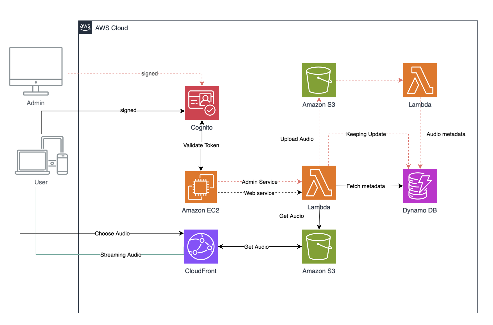

# TM_Teammusic with Django x Amazon Web Services
> Final Project Cloud Computing

### UseCase Diagram

### Amazon Web Services (AWS)

    การจัดการกับการสตรีมเสียงผ่านบริการ AWS โดยใช้หลายบริการร่วมกัน ได้แก่ Cognito, EC2, Lambda, S3, DynamoDB และ CloudFront โดยแยกการทำงานระหว่าง Admin และ User ได้ดังนี้:
1. Admin เข้าสู่ระบบ:
•	เมื่อ Admin ทำการลงชื่อเข้าใช้งาน ระบบจะใช้ Cognito เพื่อตรวจสอบและสร้าง signed token ให้กับ Admin
•	หลังจากนั้น Admin สามารถอัปโหลดไฟล์เสียงผ่านทาง S3 ได้ โดยจะใช้ Lambda ในการจัดการข้อมูลเพิ่มเติม (metadata) และเก็บใน DynamoDB
2. การทำงานของ Lambda และการจัดการข้อมูล:
•	เมื่อ Admin อัปโหลดไฟล์ไปยัง Amazon S3 จะเกิดการทริกเกอร์ Lambda ที่ทำหน้าที่อัปเดตข้อมูลเกี่ยวกับไฟล์เสียง (metadata) ลงใน DynamoDB
•	Lambda จะช่วยจัดการ metadata สำหรับไฟล์เสียง และทำการอัปเดตสถานะข้อมูลที่จำเป็นในการสตรีมและจัดเก็บข้อมูลไฟล์เสียง
 
3. การตรวจสอบ Token และสิทธิ์การเข้าถึง:
•	ระบบจะใช้ Cognito เพื่อทำการตรวจสอบ token ของทั้ง Admin และ User ทุกครั้งเมื่อมีการร้องขอข้อมูลหรือการเข้าถึงระบบ
•	Admin ใช้ token ที่ถูก Validate เพื่อติดต่อกับบริการ Admin Service ที่ทำงานบน Amazon EC2 ส่วน Customerสามารถขอข้อมูลไฟล์เสียงผ่านบริการ Web Service ที่ทำงานบน EC2
4. User เลือกเสียงและการสตรีม:
•	User จะเลือกไฟล์เสียงที่ต้องการฟัง ซึ่งไฟล์เสียงนั้นจะถูกดึงมาจาก S3 ผ่าน CloudFront
•	CloudFront จะทำหน้าที่เป็น CDN (Content Delivery Network) เพื่อเร่งความเร็วในการส่งข้อมูลเสียงและทำการสตรีมไฟล์เสียงให้กับผู้ใช้ปลายทางได้อย่างรวดเร็ว
5. การเข้าถึงข้อมูลผ่าน Lambda:
•	เมื่อ User ทำการเลือกไฟล์เสียง, Lambda จะทำงานเพื่อดึงข้อมูล metadata ที่เกี่ยวข้องจาก DynamoDB และดึงไฟล์เสียงจาก S3 เพื่อให้ CloudFront นำไปสตรีมให้ลูกค้า
•	Lambda จะมีบทบาทในการประมวลผลส่วนนี้เพื่อลดภาระของ EC2 และเพื่อเพิ่มความยืดหยุ่นในการจัดการกับการดึงข้อมูลไฟล์
