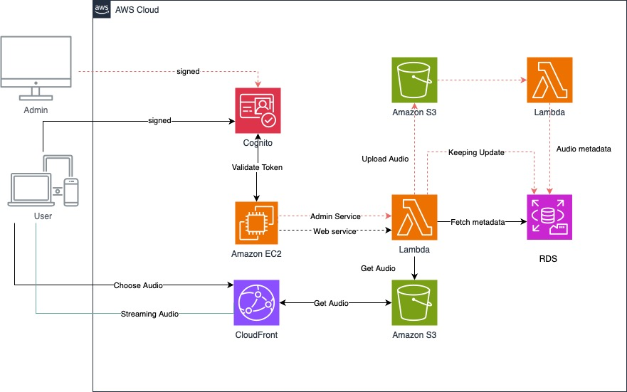
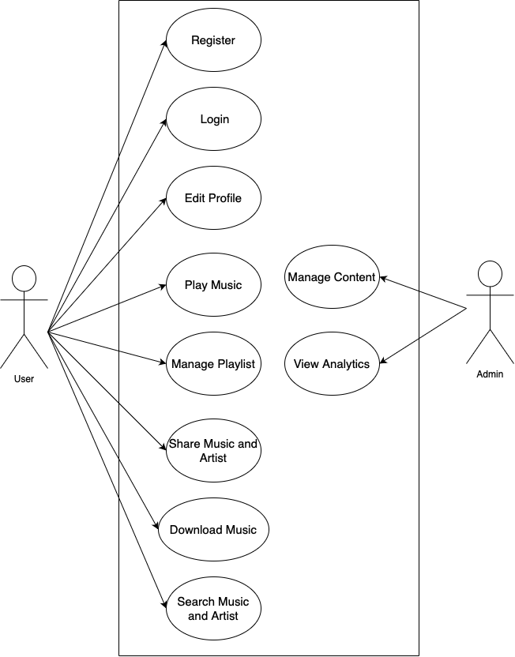

# TM_Teammusic with Django x Amazon Web Services
> Final Project Cloud Computing

### Amazon Web Services (AWS)

    การจัดการกับการสตรีมเสียงผ่านบริการ AWS โดยใช้หลายบริการร่วมกัน ได้แก่ Cognito, EC2, Lambda, S3, DynamoDB และ CloudFront โดยแยกการทำงานระหว่าง Admin และ User ได้ดังนี้:

1. **Authentication with Cognito**:
   - ผู้ใช้ทั้ง `Admin` และ `User` เข้าสู่ระบบผ่าน **Amazon Cognito** ซึ่งจัดการเรื่องการรับรองตัวตนและการอนุญาตการเข้าถึงทรัพยากรใน AWS Cloud
   - ผู้ใช้ที่ได้รับการตรวจสอบแล้วจะได้รับ **Token** ซึ่งใช้ในการยืนยันตัวตนในการใช้งานบริการต่าง ๆ ต่อไป

2. **Admin Actions**:
   - ผู้ใช้ที่เป็น `Admin` สามารถอัปโหลดไฟล์เสียงขึ้น **Amazon S3** ผ่านบริการที่ทำงานบน **Lambda**
   - หลังจากอัปโหลดไฟล์เสร็จสิ้น **Lambda** จะทำหน้าที่บันทึกข้อมูล metadata ของไฟล์เสียง เช่น ชื่อเพลง, ศิลปิน, และเวลาเล่น ลงใน **RDS (Relational Database Service)** เพื่อจัดเก็บข้อมูลที่เป็นโครงสร้าง

3. **Data Management with Lambda and RDS**:
   - Lambda จะทำงานเพื่อจัดเก็บ metadata ของไฟล์เสียงใน RDS และอัปเดตข้อมูลในฐานข้อมูลให้ตรงกับข้อมูลใน S3
   - Lambda สามารถเรียกข้อมูลจาก RDS เพื่อใช้ข้อมูล metadata ของไฟล์เสียงสำหรับการให้บริการแก่ผู้ใช้งาน

4. **User Actions and EC2**:
   - ผู้ใช้สามารถเลือกเพลงที่ต้องการฟังผ่าน **Amazon EC2** ซึ่งทำหน้าที่เป็นเซิร์ฟเวอร์หลักในการให้บริการและเชื่อมโยงไปยังบริการต่าง ๆ เช่น CloudFront และ Lambda
   - EC2 สามารถเชื่อมต่อไปยัง Lambda สำหรับการดึงข้อมูล metadata ของไฟล์เสียงจาก RDS เพื่อให้ผู้ใช้สามารถเลือกไฟล์เสียงที่ต้องการได้ง่าย

5. **CloudFront and S3 for Streaming Audio**:
   - เมื่อผู้ใช้เลือกไฟล์เสียงที่จะเล่น **CloudFront** จะทำหน้าที่เป็น Content Delivery Network (CDN) เพื่อดึงไฟล์เสียงจาก **Amazon S3** มาให้ผู้ใช้ฟัง
   - CloudFront ช่วยในการเร่งความเร็วในการสตรีมไฟล์เสียงไปยังผู้ใช้ทั่วโลก ด้วยการกระจายเนื้อหาและแคชข้อมูลในตำแหน่งต่าง ๆ ที่ใกล้กับผู้ใช้

6. **Workflow Summary**:
   - **Admin**: อัปโหลดไฟล์เสียงไปยัง S3 ผ่าน Lambda และเก็บข้อมูล metadata ลงใน RDS
   - **User**: เข้าสู่ระบบผ่าน Cognito เลือกเพลงที่ต้องการฟังผ่าน EC2 โดยข้อมูลจะมาจาก Lambda และ RDS หลังจากเลือกเพลงแล้ว CloudFront จะดึงข้อมูลเสียงจาก S3 เพื่อสตรีมไปยังผู้ใช้

### สรุป
- **Cognito**: ใช้ในการจัดการรับรองตัวตนผู้ใช้
- **Lambda**: ใช้ในการจัดการอัปโหลดข้อมูล, จัดเก็บ metadata, และเชื่อมโยงระหว่าง S3 และ RDS
- **RDS**: ใช้ในการเก็บข้อมูล metadata ของไฟล์เสียง
- **S3**: ใช้ในการเก็บไฟล์เสียง
- **CloudFront**: ใช้ในการสตรีมไฟล์เสียงจาก S3 ให้แก่ผู้ใช้ผ่าน CDN เพื่อความรวดเร็ว

### UseCase Diagram

