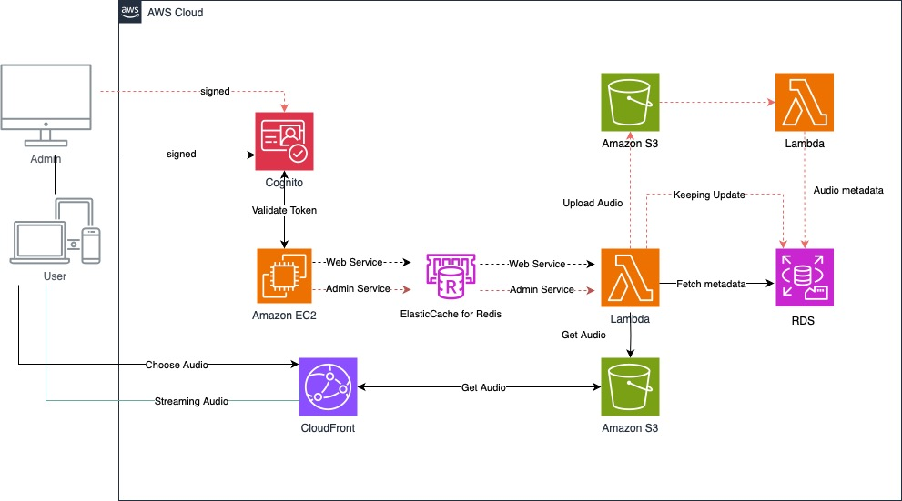

# TM_Teammusic with Django x Amazon Web Services
> Final Project Cloud Computing

### Amazon Web Services (AWS)

จากภาพแสดงโครงสร้างสถาปัตยกรรม AWS สำหรับระบบจัดการเสียงที่รองรับการสตรีมมิ่ง ซึ่งมีองค์ประกอบและการทำงานที่สำคัญดังนี้:

1. **Cognito:**  
   - ใช้สำหรับการจัดการการตรวจสอบสิทธิ์ (authentication) ของผู้ใช้ทั้งผู้ดูแลระบบ (Admin) และผู้ใช้งานทั่วไป (User) โดยให้บริการการลงชื่อเข้าใช้ที่ปลอดภัย
   - เมื่อผู้ใช้หรือผู้ดูแลระบบเข้าสู่ระบบ สำเร็จแล้ว Cognito จะสร้างโทเค็นที่ยืนยันตัวตนของผู้ใช้ และส่งโทเค็นนี้เพื่อให้ระบบทำงานต่อไป

2. **Amazon EC2 และ ElasticCache for Redis:**  
   - Amazon EC2 ใช้เป็นเซิร์ฟเวอร์หลักในการให้บริการเว็บ (Web Service) และบริการสำหรับผู้ดูแลระบบ (Admin Service)
   - ElasticCache for Redis ทำหน้าที่แคชข้อมูลบางอย่างที่เรียกใช้บ่อย ๆ เพื่อช่วยเพิ่มความเร็วในการตอบสนอง ลดภาระในการเข้าถึงฐานข้อมูลหลักบ่อย ๆ

3. **Amazon S3:**  
   - ทำหน้าที่เป็นพื้นที่จัดเก็บข้อมูลเสียง (Audio Files) โดยเมื่อมีการอัปโหลดไฟล์เสียงจากผู้ดูแลระบบ Lambda จะรับข้อมูลและบันทึกลงใน S3
   - ไฟล์เสียงที่เก็บใน S3 สามารถเข้าถึงได้จาก CloudFront เพื่อการสตรีมมิ่งให้ผู้ใช้

4. **AWS Lambda:**  
   - Lambda ถูกเรียกใช้ในหลายหน้าที่ เช่น การอัปโหลดไฟล์เสียงไปยัง S3, การอัปเดตข้อมูล metadata ของไฟล์เสียงไปยัง RDS และการดึงข้อมูลเสียงจาก S3 เพื่อนำไปให้บริการผ่าน CloudFront
   - Lambda จะทำงานแบบ Serverless ซึ่งช่วยลดภาระในการจัดการเซิร์ฟเวอร์เองและทำให้การประมวลผลเกิดขึ้นเมื่อมีการเรียกใช้งานเท่านั้น

5. **Amazon RDS:**  
   - เป็นฐานข้อมูลที่เก็บข้อมูล metadata ของไฟล์เสียง เช่น ข้อมูลเกี่ยวกับไฟล์เสียงหรือข้อมูลที่เกี่ยวข้องอื่น ๆ
   - Lambda สามารถดึงข้อมูล metadata จาก RDS เมื่อจำเป็นและเก็บข้อมูลอัปเดตเพื่อให้แน่ใจว่าข้อมูลเป็นปัจจุบัน

6. **Amazon CloudFront:**  
   - ทำหน้าที่เป็น Content Delivery Network (CDN) สำหรับการให้บริการสตรีมมิ่งไฟล์เสียงให้กับผู้ใช้งาน ช่วยให้ผู้ใช้สามารถเข้าถึงไฟล์เสียงได้รวดเร็วจากตำแหน่งที่ใกล้กับผู้ใช้งาน
   - ผู้ใช้เลือกไฟล์เสียงที่ต้องการฟังแล้ว CloudFront จะสตรีมไฟล์เสียงจาก Amazon S3 ให้ผู้ใช้งานอย่างมีประสิทธิภาพ

### การทำงานโดยรวม
1. **Authentication:** ผู้ใช้งานและผู้ดูแลระบบเข้าสู่ระบบผ่าน Cognito เพื่อรับโทเค็นการยืนยันตัวตน
2. **อัปโหลดไฟล์เสียง:** ผู้ดูแลระบบอัปโหลดไฟล์เสียงผ่านระบบ โดย Lambda จะบันทึกไฟล์ไปยัง S3 และอัปเดตข้อมูล metadata ไปยัง RDS
3. **การให้บริการข้อมูล:** ผู้ใช้เลือกไฟล์เสียงผ่าน Web Service ที่รันบน EC2 โดยข้อมูลบางส่วนอาจถูกเก็บใน Redis เพื่อเร่งการเข้าถึง
4. **Streaming:** เมื่อผู้ใช้ต้องการสตรีมไฟล์เสียง ระบบจะใช้ CloudFront เพื่อดึงข้อมูลจาก S3 และส่งให้ผู้ใช้

### UseCase Diagram

