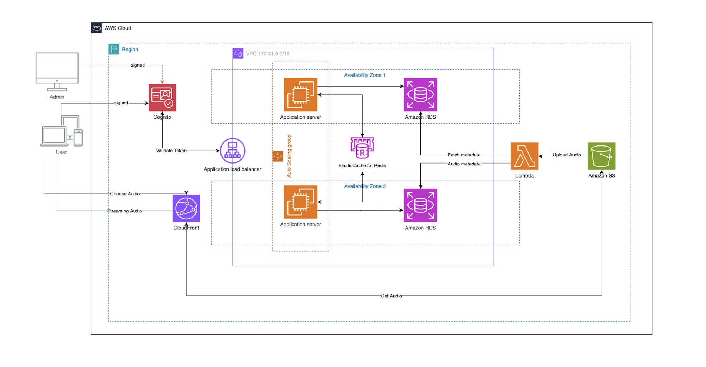

# TM_Teammusic with Django x Amazon Web Services
> Final Project Cloud Computing

### Amazon Web Services (AWS)

การจัดการและสตรีมมิ่งไฟล์เสียง (Audio Streaming System)

### 1. การยืนยันตัวตนและการอนุญาตการเข้าถึง (Authentication & Authorization)
   - ผู้ใช้ (User) หรือผู้ดูแลระบบ (Admin) ทำการลงชื่อเข้าใช้ผ่าน **Amazon Cognito** ซึ่งทำหน้าที่ในการจัดการการยืนยันตัวตนและการให้สิทธิ์ในการเข้าถึง
   - เมื่อผู้ใช้หรือนักพัฒนาลงชื่อเข้าใช้ ระบบจะให้ **Token** กลับมาเพื่อใช้ในการเข้าถึงบริการต่าง ๆ ในระบบ
   - Token นี้จะถูกส่งไปยัง **Application Load Balancer** เพื่อทำการตรวจสอบความถูกต้อง (Validate Token) ก่อนจะเข้าถึง Application Servers

### 2. การประมวลผลผ่าน Application Server
   - Application Load Balancer จะกระจายการร้องขอ (Request) จากผู้ใช้ไปยัง **Application Servers** ที่ตั้งอยู่ใน Availability Zones ต่าง ๆ เพื่อรองรับปริมาณการใช้งานที่สูง
   - Application Servers ทำงานภายใน **Auto Scaling Group** ซึ่งจะช่วยให้ระบบสามารถปรับขนาด (Scale) เพิ่มหรือลดจำนวนเซิร์ฟเวอร์ตามความต้องการ

### 3. การเก็บข้อมูลด้วยฐานข้อมูล (Database)
   - Application Servers สามารถเข้าถึงข้อมูลผ่าน **Amazon RDS** ที่ใช้สำหรับเก็บข้อมูล Metadata ของไฟล์เสียง
   - ฐานข้อมูลนี้ถูกกระจายอยู่ใน Availability Zones หลาย ๆ โซนเพื่อเพิ่มความทนทานและความปลอดภัยของข้อมูล

### 4. การใช้ Cache เพื่อเพิ่มประสิทธิภาพ
   - ระบบใช้ **Elasticache for Redis** เพื่อเก็บข้อมูลในหน่วยความจำ (In-Memory Cache) ซึ่งช่วยเพิ่มประสิทธิภาพในการเข้าถึงข้อมูลบ่อย ๆ โดยไม่จำเป็นต้องเข้าถึงฐานข้อมูลทุกครั้ง
   - Application Servers จะเข้าถึงข้อมูลผ่าน Redis เพื่อให้การตอบสนองเร็วขึ้นสำหรับข้อมูลที่ไม่เปลี่ยนแปลงบ่อยนัก

### 5. การจัดเก็บไฟล์เสียง
   - ไฟล์เสียงจะถูกเก็บไว้ใน **Amazon S3** ซึ่งเป็นบริการเก็บข้อมูลแบบ Object Storage ที่สามารถจัดเก็บไฟล์ขนาดใหญ่ได้
   - ไฟล์เสียงสามารถถูกอัปโหลดไปที่ S3 ผ่าน Lambda Function เมื่อมีการอัปโหลดหรืออัปเดตข้อมูลเสียง

### 6. การประมวลผลผ่าน Lambda
   - **AWS Lambda** ถูกใช้เพื่อประมวลผลข้อมูลที่เกี่ยวข้องกับไฟล์เสียง เช่นการอัปโหลดหรือการดึงข้อมูล Metadata
   - Lambda สามารถทำงานได้โดยไม่ต้องตั้งค่าเซิร์ฟเวอร์ และสามารถเชื่อมต่อกับ S3 และดึงข้อมูลไปประมวลผลได้อย่างรวดเร็ว

### 7. การสตรีมมิ่งไฟล์เสียง (Audio Streaming)
   - ผู้ใช้สามารถเลือกฟังไฟล์เสียงผ่าน **CloudFront** ซึ่งเป็น Content Delivery Network (CDN) ที่ช่วยเพิ่มความเร็วในการส่งข้อมูลให้กับผู้ใช้ทั่วโลก
   - CloudFront จะเชื่อมต่อกับ S3 เพื่อดึงไฟล์เสียงมาและสตรีมให้กับผู้ใช้ โดยลด Latency และเพิ่มประสิทธิภาพในการรับส่งข้อมูล

### สรุปการทำงานของระบบ
- ผู้ใช้หรือผู้ดูแลระบบลงชื่อเข้าใช้ผ่าน Cognito เพื่อรับ Token ยืนยันตัวตน
- Application Load Balancer ตรวจสอบ Token และกระจาย Request ไปยัง Application Servers
- Application Servers ใช้ Redis และ RDS เพื่อเข้าถึงข้อมูลและ Metadata ของไฟล์เสียง
- ไฟล์เสียงถูกเก็บใน S3 และสามารถเข้าถึงได้ผ่าน CloudFront เพื่อการสตรีมมิ่ง
- Lambda ถูกใช้สำหรับการประมวลผลที่ไม่ต้องใช้เซิร์ฟเวอร์ (เช่นการอัปโหลดไฟล์เสียง)

### UseCase Diagram

